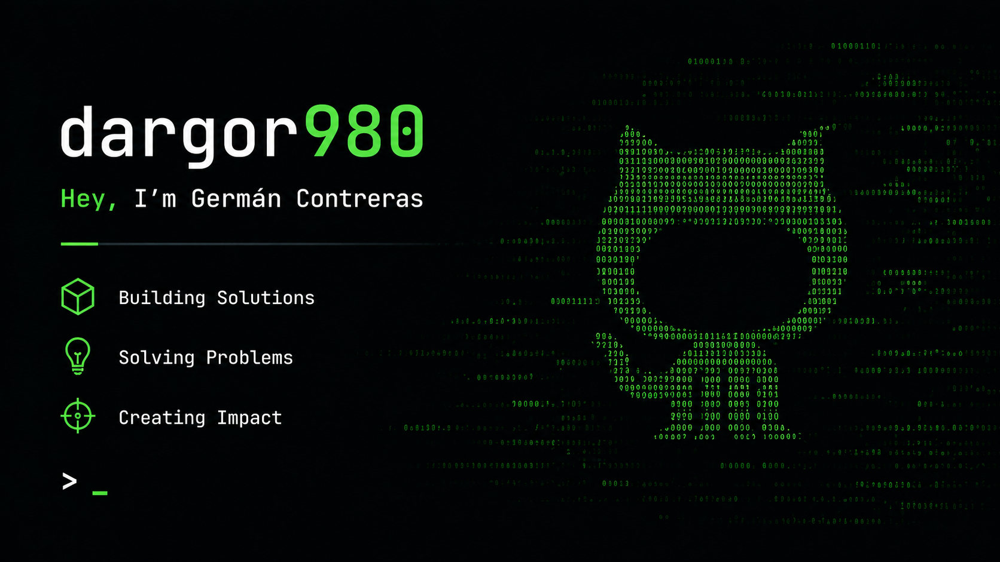

 

# German Contreras

Building solutions, solving problems, and creating impact through practical software.

I work as `dargor980`, focused on turning technical ideas into reliable, usable projects. This profile is the entry point for my public work, experiments, and engineering notes.
**<h3 align="left">Connect with me:</h3>** 

 

 

## Focus

- Building practical software solutions with clear user value.
- Solving technical problems with a direct, maintainable approach.
- Creating reusable foundations for future products and automation.
- Keeping projects understandable, documented, and easy to evolve.

**<h3 align="left">Skills</h3>**

                

## Featured Work

This section is reserved for selected public repositories. The goal is to highlight projects with clear outcomes, not just a full repo list.

Coming next:

- Production-ready projects worth pinning.
- Short descriptions that explain the problem, approach, and result.
- Links to active repositories and demos when available.

## GitHub Activity

